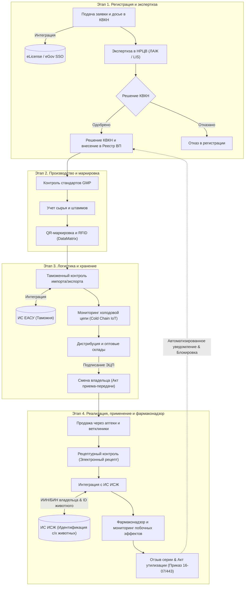

# Архитектура и сквозной жизненный цикл ГИС «Дари-Дәрмек»
# System Architecture & End-to-End Lifecycle

Настоящий документ описывает целевую архитектуру, 4 основных этапа жизненного цикла обращения ветеринарных препаратов, внешние интеграции и план технической реализации в кодовой базе Kotlin Multiplatform / Ktor.

---

## 📐 Архитектурная диаграмма / Architecture Flowchart

---

## 🏛️ 4 Этапа жизненного цикла и их реализация в системе

### 1. Этап 1. Регистрация и экспертиза (Registration & Expertise)
* **Бизнес-логика**:
  * Заявитель подает электронную заявку и досье в КВКН МСХ РК через интеграцию с **eGov / eLicense**.
  * НРЦВ (Национальный референтный центр по ветеринарии) проводит лабораторные и документальные испытания в цифровом модуле ЛИС (ЛАЖ).
  * При положительном решении КВКН препарат вносится в Единый государственный реестр ветеринарных средств РК/ЕАЭС.
* **Маппинг на кодовую базу (`:shared` & `:server`)**:
  * **Модели данных**: `ApplicationDto`, `DossierPartDto`, `LabProtocolDto`, `DrugDto`
  * **API Endpoints**:
    * `POST /api/applications` — подача заявления
    * `POST /api/applications/{id}/lab-trial` — внесение результатов испытаний НРЦВ
    * `POST /api/applications/{id}/approve` — решение КВКН и генерация регистрационного номера
  * **UI Экраны**: [GisScreens.kt](file:///d:/!ag/dari/shared/src/commonMain/kotlin/com/dari/dermek/ui/GisScreens.kt) (`ApplicationsScreen`, `RegistrationWizard`)

---

### 2. Этап 2. Производство и маркировка (Production & Marking)
* **Бизнес-логика**:
  * Учет соответствия завода стандартам **GMP**.
  * Прослеживаемость входящего сырья и коллекций штаммов микроорганизмов.
  * Генерация уникальных защищенных **DataMatrix QR-кодов** и RFID-меток для каждого флакона/упаковки партии.
* **Маппинг на кодовую базу**:
  * **Модели данных**: `BatchDto`, `QrVialDto`, `ManufacturerDto`
  * **API Endpoints**:
    * `POST /api/batches/register` — регистрация новой производственной серии
    * `POST /api/qr/generate` — генерация пакета уникальных QR-кодов
  * **UI Экраны**: [GisScreens.kt](file:///d:/!ag/dari/shared/src/commonMain/kotlin/com/dari/dermek/ui/GisScreens.kt) (`BatchManagementScreen`, `QrGeneratorView`)

---

### 3. Этап 3. Логистика и хранение (Logistics & Storage)
* **Бизнес-логика**:
  * **Таможенный контроль**: интеграция с **ИС ЕАСУ** для проверки легальности ввозимых партий на КПП.
  * **Мониторинг холодовой цепи**: фиксация показателей температурных датчиков (Cold Chain IoT) при транспортировке термолабильных вакцин.
  * **Смена владельца**: обязательное подписание акта приема-передачи с помощью **ЭЦП (NCALayer)** при движении товара (завод ➔ дистрибьютор ➔ аптека).
* **Маппинг на кодовую базу**:
  * **Модели данных**: `ImportDeclarationDto`, `ColdChainTelemetryDto`, `OwnershipTransferDto`
  * **API Endpoints**:
    * `POST /api/import-declarations` — проверки на границе
    * `POST /api/cold-chain/telemetry` — логирование температуры
    * `POST /api/batches/transfer-ownership` — передача прав с ЭЦП
  * **UI Экраны**: [GisScreens.kt](file:///d:/!ag/dari/shared/src/commonMain/kotlin/com/dari/dermek/ui/GisScreens.kt) (`CustomsInspectionScreen`, `WarehouseScreen`, `ColdChainView`)

---

### 4. Этап 4. Реализация, применение и фармаконадзор (Retail, Application & Pharmacovigilance)
* **Бизнес-логика**:
  * **Рецептурный контроль**: погашение электронных рецептов при отпуске препаратов ветклиниками и аптеками.
  * **Интеграция с ИС ИСЖ**: привязка списываемого препарата к ИИН/БИН владельца животных и уникальному ID животного (бирка/чип).
  * **Фармаконадзор и отзыв серии**: регистрация сообщений о побочных действиях. При выявлении брака или тяжелых реакций система автоматически **блокирует всю серию** во всех аптеках/складах и формирует **Акт утилизации** (Приказ МСХ РК № 16-07/443).
* **Маппинг на кодовую базу**:
  * **Модели данных**: `VetPrescriptionDto`, `AdverseEventDto`, `DestructionActDto`
  * **API Endpoints**:
    * `POST /api/prescriptions/dispense` — погашение рецепта
    * `POST /api/pharmacovigilance/report` — экстренное извещение о побочном эффекте
    * `POST /api/batches/{id}/recall` — автоматический отзыв серии по всей стране
  * **UI Экраны**: [GisScreens.kt](file:///d:/!ag/dari/shared/src/commonMain/kotlin/com/dari/dermek/ui/GisScreens.kt) (`PharmacovigilanceScreen`, `DisposalScreen`, `IsjIntegrationView`)

---

## 🛠️ План применения архитектуры в коде (Implementation Roadmap)

### Шаг 1. Расширение структуры Базы Данных (PostgreSQL / Exposed)
Обновить схемы в [Tables.kt](file:///d:/!ag/dari/server/src/main/kotlin/com/dari/dermek/server/db/Tables.kt):
1. Добавить таблицу `ImportDeclarations` (интеграция ИС ЕАСУ).
2. Добавить таблицу `VetPrescriptions` (электронные рецепты & привязка к ИСЖ).
3. Добавить поля `coldChainStatus` и `ownerBin` в таблицу `Batches`.

### Шаг 2. Реализация Ktor Маршрутов (REST API)
В [Routes.kt](file:///d:/!ag/dari/server/src/main/kotlin/com/dari/dermek/server/routes/Routes.kt):
1. Реализовать `/api/eassu/check-declaration` для имитации ответа Таможни ИС ЕАСУ.
2. Реализовать `/api/isj/animal-lookup` для связи с ИС ИСЖ по ИИН и ID животного.
3. Реализовать триггер `/api/pharmacovigilance/recall-batch` для отправки push-уведомлений и смены статуса серии на `RECALLED`.

### Шаг 3. Подключение UI & Офлайн-фолбэка (`:shared`)
В [GisHttpClient.kt](file:///d:/!ag/dari/shared/src/commonMain/kotlin/com/dari/dermek/api/GisHttpClient.kt):
1. Реализовать методы работы с `ImportDeclarations` и `IsjIntegration`.
2. Обеспечить прозрачный fallback на `GisApiClient` (локальные mock-данные), если внешние ИС (ЕАСУ, ИСЖ, eLicense) недоступны.

---
*Документ создан и зафиксирован в папке `architecture/system_architecture.md`.*
