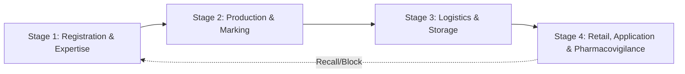

# DARI-Дәрмек Project Analysis

## 1. Project Overview

**Project Name:** Дари-дермек (Dari-Dermek) — Veterinary Medicine Knowledge Base & GIS Platform

**Purpose:** A unified knowledge base and geographic information system (GIS) for regulating veterinary drugs, disinfectants, and diagnostic agents within the Eurasian Economic Union (EAEU) and the Republic of Kazakhstan.

**Domain:** Veterinary pharmaceutical regulation, registration workflows, supply chain tracking, pharmacovigilance, and customs control.

---

## 2. Technology Stack

| Layer | Technology |
|-------|------------|
| **Language** | Kotlin (multiplatform) |
| **UI Framework** | Jetpack Compose Multiplatform (WasmJs, Desktop, Android, iOS) |
| **Backend** | Ktor (Netty engine) with Exposed ORM |
| **Database** | PostgreSQL 16 (with Flyway migrations) |
| **Authentication** | JWT (Auth0 library) + eGov SSO integration |
| **Navigation** | Voyager |
| **Settings/Storage** | Russhwolf Settings (cross-platform) |
| **Serialization** | kotlinx.serialization |
| **Containerization** | Docker + Docker Compose + Nginx |
| **Build System** | Gradle Kotlin DSL (version catalog) |

---

## 3. Project Structure (Gradle Modules)

```
dari-dermek/
├── shared/              # Kotlin Multiplatform shared module (UI + Business Logic)
│   ├── commonMain/      # Shared code: App, UI screens, models, API clients
│   ├── androidMain/     # Android-specific platform implementation
│   ├── desktopMain/     # Desktop (JVM) platform implementation
│   ├── iosMain/         # iOS platform implementation
│   └── wasmJsMain/      # WebAssembly JS platform implementation
├── androidApp/          # Android app entry point (MainActivity)
├── desktopApp/          # Desktop app entry point (main.kt)
├── webApp/              # Web app (WasmJs + Compose for Web)
├── server/              # Ktor backend API server
├── architecture/        # Architecture documentation
├── regulations/         # 9 regulatory knowledge base documents
├── systems/             # System documentation (Гален, DEG)
├── kb/                  # Research knowledge base (interviews, procedures)
└── plans/               # Analysis and planning documents
```

---

## 4. Core Domain Model

### 4.1 Four-Stage Lifecycle

The system models the complete lifecycle of veterinary pharmaceuticals:



### 4.2 Key Entities

| Entity | Description |
|--------|-------------|
| [`User`](server/src/main/kotlin/com/dari/dermek/server/db/Tables.kt:8) | Users with roles (APPLICANT, COMMITTEE_STAFF, NRCV_EXPERT, LAB_ANALYST, BORDER_INSPECTOR, WAREHOUSE_CLERK, FARMER_VET, ADMIN) |
| [`Drug`](server/src/main/kotlin/com/dari/dermek/server/db/Tables.kt:23) | Veterinary drug registry (trade name, INN, type, dosage, manufacturer, registration number, Annex 8/16 status) |
| [`Application`](server/src/main/kotlin/com/dari/dermek/server/db/Tables.kt:56) | Registration application with timeline tracking (pathway, status, working days, clock pause) |
| [`Batch`](server/src/main/kotlin/com/dari/dermek/server/db/Tables.kt:98) | Production batch with QR/vial tracking |
| [`DossierPart`](server/src/main/kotlin/com/dari/dermek/server/db/Tables.kt:87) | CTD dossier parts (1-4) for registration |
| [`RegulationItem`](shared/src/commonMain/kotlin/com/dari/dermek/Models.kt:6) | Knowledge base regulation entry with multi-language support |

### 4.3 User Roles

| Role | Description |
|------|-------------|
| `APPLICANT` | Company submitting registration applications |
| `COMMITTEE_STAFF` | KVKMN (Committee) committee member |
| `NRCV_EXPERT` | National Reference Center expert |
| `LAB_ANALYST` | Laboratory analyst |
| `BORDER_INSPECTOR` | Customs border inspector |
| `WAREHOUSE_CLERK` | Warehouse operator |
| `FARMER_VET` | Farmer/veterinarian end user |
| `ADMIN` | System administrator |

---

## 5. Architecture Details

### 5.1 UI Architecture

- **Framework:** Compose Multiplatform with Voyager navigation
- **Theme:** [`GisTheme`](shared/src/commonMain/kotlin/com/dari/dermek/ui/GisTheme.kt) — Dark professional theme (steel blue primary, dark charcoal background)
- **Screens:** [`GisScreens.kt`](shared/src/commonMain/kotlin/com/dari/dermek/ui/GisScreens.kt) (2067 lines) — comprehensive screen implementations
- **Components:** [`GisComponents.kt`](shared/src/commonMain/kotlin/com/dari/dermek/ui/GisComponents.kt) — reusable UI components
- **Icons:** [`GisIcons.kt`](shared/src/commonMain/kotlin/com/dari/dermek/ui/GisIcons.kt) — custom icon definitions
- **State Management:** Voyager ScreenModel + Kotlinx StateFlow

### 5.2 API Layer

| Component | Description |
|-----------|-------------|
| [`GisHttpClient`](shared/src/commonMain/kotlin/com/dari/dermek/api/GisHttpClient.kt) | HTTP client with content negotiation |
| [`GisApiClient`](shared/src/commonMain/kotlin/com/dari/dermek/api/GisApiClient.kt) | Mock API client for prototype (8 user roles, mock drugs, applications, batches) |
| [`ApiModels`](shared/src/commonMain/kotlin/com/dari/dermek/api/ApiModels.kt) | Shared API data transfer objects |

### 5.3 Backend API

| Component | File |
|-----------|------|
| [`Application.kt`](server/src/main/kotlin/com/dari/dermek/server/Application.kt) | Ktor server setup, plugins, JWT auth |
| [`Routes.kt`](server/src/main/kotlin/com/dari/dermek/server/routes/Routes.kt) | REST API route definitions |
| [`AuthRoutes.kt`](server/src/main/kotlin/com/dari/dermek/server/routes/AuthRoutes.kt) | Authentication endpoints |
| [`Tables.kt`](server/src/main/kotlin/com/dari/dermek/server/db/Tables.kt) | Exposed ORM table definitions |
| [`DatabaseFactory.kt`](server/src/main/kotlin/com/dari/dermek/server/db/DatabaseFactory.kt) | PostgreSQL connection setup |

### 5.4 Database Schema (13 Tables)

From [`V1__init_schema.sql`](server/src/main/resources/db/migration/V1__init_schema.sql):

1. `users` — User accounts with roles and eGov SSO
2. `manufacturers` — Pharmaceutical manufacturers
3. `drugs` — Drug registry
4. `applications` — Registration applications with timeline
5. `application_status_history` — Status change audit trail
6. `dossier_parts` — CTD dossier document storage
7. `batches` — Production batch tracking
8. `qr_vials` — QR code/vial level tracking
9. `import_declarations` — Customs import declarations
10. `vet_prescriptions` — Electronic prescriptions
11. `cold_chain_telemetry` — Temperature monitoring
12. `adverse_events` — Pharmacovigilance reports
13. `ownership_transfers` — Chain of custody

---

## 6. External System Integrations (Planned)

| System | Integration Point | Purpose |
|--------|-------------------|---------|
| **eGov SSO / eLicense** | User authentication | Single sign-on for applicants |
| **ИС ЕАСУ (Customs)** | Import declarations | Border control verification |
| **ИС ИСЖ (Animal ID)** | Prescription dispensing | Animal owner identification (IIN/BIN) |
| **Гален (ФГИС ВетИС)** | Drug registry sync | Rosselkhoznadzor drug database |
| **NCALayer** | Electronic signature | Digital signature for ownership transfers |

---

## 7. Knowledge Base Content

### Regulations (9 documents)

| Document | Topic |
|----------|-------|
| [`vet_drugs_eaeu.md`](regulations/vet_drugs_eaeu.md) | EAEU veterinary drug circulation rules |
| [`diagnostics_eaeu.md`](regulations/diagnostics_eaeu.md) | EAEU veterinary diagnostics rules |
| [`disinfectants_eaeu.md`](regulations/disinfectants_eaeu.md) | EAEU disinfectants rules |
| [`registration_rules_kz.md`](regulations/registration_rules_kz.md) | KZ state registration procedures |
| [`ntd_approval_kz.md`](regulations/ntd_approval_kz.md) | KZ NTD approval process |
| [`testing_and_trials_kz.md`](regulations/testing_and_trials_kz.md) | KZ testing and trials procedures |
| [`safety_monitoring_kz.md`](regulations/safety_monitoring_kz.md) | KZ pharmacovigilance |
| [`disposal_and_writeoff_kz.md`](regulations/disposal_and_writeoff_kz.md) | KZ disposal and write-off rules |
| [`prohibited_drugs_kz.md`](regulations/prohibited_drugs_kz.md) | KZ prohibited drugs list |

### Research Knowledge Base

- [`gis_modernization_kb.md`](kb/gis_modernization_kb.md) — GIS reengineering knowledge base
- Excel files with questions/interviews
- PDF documents with expert interviews

---

## 8. Current State Assessment

### What's Implemented

- **Shared UI Module:** Full Compose Multiplatform UI with dark theme, multi-language support (RU/KK/EN), tabbed navigation, search, regulation viewer
- **Mock API Layer:** Complete mock data for 8 drugs, 8+ applications, batches, users with all 8 roles
- **Backend Server:** Ktor server with JWT auth, CORS, content negotiation, status pages
- **Database:** PostgreSQL schema with 13 tables, Exposed ORM mappings
- **Docker:** Complete docker-compose setup (PostgreSQL + Server + Web with Nginx)
- **Knowledge Base:** 9 regulation documents with multi-language content
- **Desktop App:** Working desktop application
- **Web App:** WasmJs compiled web application with Skiko

### What's Planned (Per Architecture Document)

- Extended database tables for import declarations, vet prescriptions, cold chain
- REST API endpoints for EASSU customs check, ISJ animal lookup, pharmacovigilance recall
- Offline fallback mechanism for external system unavailability
- Timeline calculator and workflow simulator features

---

## 9. Key Files Reference

| File | Purpose |
|------|---------|
| [`App.kt`](shared/src/commonMain/kotlin/com/dari/dermek/App.kt) | Main Compose app entry (1017 lines) |
| [`GisScreens.kt`](shared/src/commonMain/kotlin/com/dari/dermek/ui/GisScreens.kt) | All GIS screens (2067 lines) |
| [`MainScreenModel.kt`](shared/src/commonMain/kotlin/com/dari/dermek/MainScreenModel.kt) | Main screen state management |
| [`RegulationRepository.kt`](shared/src/commonMain/kotlin/com/dari/dermek/RegulationRepository.kt) | Regulation data with caching (556 lines) |
| [`GisApiClient.kt`](shared/src/commonMain/kotlin/com/dari/dermek/api/GisApiClient.kt) | Mock API client (182 lines) |
| [`Application.kt`](server/src/main/kotlin/com/dari/dermek/server/Application.kt) | Ktor server configuration (157 lines) |
| [`Tables.kt`](server/src/main/kotlin/com/dari/dermek/server/db/Tables.kt) | Database table definitions (223 lines) |
| [`V1__init_schema.sql`](server/src/main/resources/db/migration/V1__init_schema.sql) | Full SQL schema (302 lines) |
| [`system_architecture.md`](architecture/system_architecture.md) | Architecture documentation |

---

## 10. Summary

The DARI-Дәрмек project is a **Kotlin Multiplatform veterinary pharmaceutical regulation platform** targeting the EAEU and Kazakhstan markets. It combines:

1. A **knowledge base** with comprehensive regulatory documentation in three languages (RU, KK, EN)
2. A **GIS simulation/prototype** with mock data demonstrating the full 4-stage lifecycle of veterinary drug regulation
3. A **multiplatform UI** targeting Desktop (JVM), Web (WasmJs), Android, and iOS
4. A **backend API server** with PostgreSQL, JWT authentication, and Exposed ORM

The project is at a **prototype/MVP stage** with comprehensive mock data and UI, a working backend server, and a detailed architecture plan for full implementation including external system integrations.
